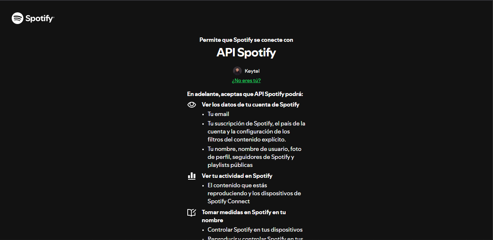
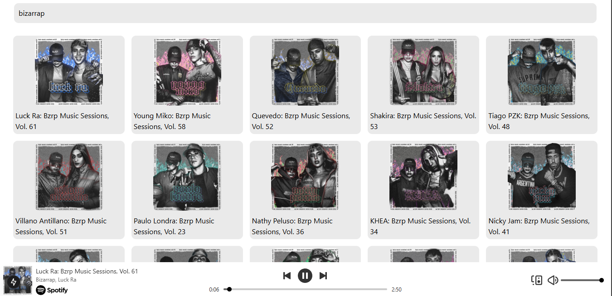
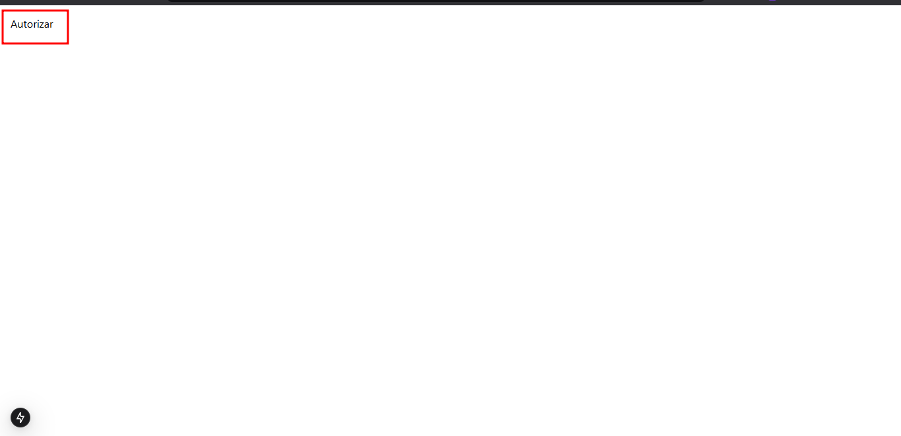

# ViMusic - Buscador de música Online




## Descripción
ViMusic es un reproductor y buscador de música online que se construyo usando el framework `Nextjs v15`, `Typescript` y `Tailwindcss`; y por ultimo se esta usando la `API Spotify` para la búsqueda y la reproducción de la música.

Cuenta con un **`buscador en tiempo real`**, solo tiene que poner el nombre de la música o el artista que desee y listo, sin la necesidad de hacer click en botones para buscar.

## Empezando
Primero clone el repositorio:
```bash
git clone https://github.com/keytelpumaylle/ViMusic.git
```
Finalmente instale las dependencias:
```bash
npm install
```

## Configurando
Para poder configurar es necesario que se cree su cuenta en `Spotify Developer`, donde podrá obtener las credenciales, `ID_SPOTIFY` y el `CLIENT_SECRET`.

Teniendo las credenciales, abra el archivo `src/app/api/autorizer.tsx` y pegue su id de Spotify:
```typescript
const SPOTIFY_CLIENT_ID: string = 'TU_ID_SPOTIFY'; 
```
Y por ultimo, abra el archivo `src/app/api/getToken.tsx` y pegue su id de spotify mas el Secret Spotify:
```typescript
client_id: 'Reemplaza con tu CLIENT ID de spotify',
client_secret: 'Reemplaza con tu CLIENT_SECRET de spotify', 
```

## Listo

Ejecute el proyecto y solo necesita hacer click en `autorizar`, y listo.




<div style="background-color: #FF404025; color: #FF4040; padding: 10px; border-left: 4px solid #c62828;">
    <strong>Advertencia:</strong> 
    Para poder reproducir las músicas, su cuenta de spotify tiene que ser premiun, de lo contrario no podrá reproducirlas;
    Pero SI PODRA BUSCAR LAS MUSICAS.
</div>
